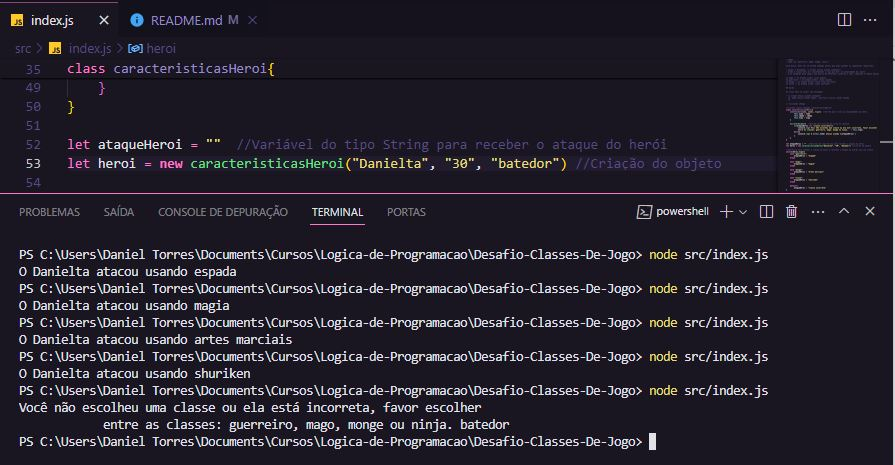

# Desafio-Classes-De-Jogo

Neste projeto irei descrever a criação de um código em JavaScript, com a saída no console, de acordo com o padrão especificado no desafio de projeto logo abaixo.

- Curso: Lógica de Programação
- Instrutor: Felipe Silva Aguiar
- Instituição: [DIO.me](https://www.dio.me/)

## Desafio

### Objetivo:

Neste desafio irei uma classe que represente um herói de uma aventura e que possua as seguintes propriedades:

- nome
- idade
- tipo (ex: guerreiro, mago, monge, ninja)

Além disso, deve-se ter um método chamado atacar que deve atender os seguintes requisitos:

- Exibir a mensagem: "O __{tipo}__ atacou usando __{ataque}__"
- Aonde o __{tipo}__ deve ser concatenando o tipo que está na propriedade da classe
- No __{ataque}__ devo seguir uma descrição diferente conforme o __tipo__, seguindo a tabela abaixo:

se guerreiro -> no ataque exibir (usou espada)
se mago -> no ataque exibir (usou magia)
se monge -> no ataque exibir (usou artes marciais)
se ninja -> no ataque exibir (usou shuriken)

### Saída

Ao final deve se exibir uma mensagem:

- "o {tipo} atacou usando {ataque}"
- Ex: O mago atacou usando magia; O guerreiro atacou usando espada

## Criando Repositório

Primeiramente criei o repositório no __GitHub__ com nome __"Desafio-Classes-De-Jogo"__ e clonei o repositório para meu PC utilizando o __GitHub Desktop__.

## Abrindo Visual Studio Code

Para este projeto, mais uma vez eu utilizei o __VS Code da Microsoft__, que é gratuito e fácil de usar. Já estou me abituando, mas ainda tenho muito que aprender.

## Criando o Projeto

Após VS Code aberto, criei a pasta __"src"__ e dentro dela criei o arquivo __"index.js"__, aonde irei criar o código em __JavaScript__. Ainda tenho pouco conhecimento em  __JavaScript__, portanto, todos os conhecimentos que irei utilizar são os que eu aprendi até agora.

## Código

- Inicialmente criei uma classe __"caracteristicasHeroi"__ com função __"constructor"__, aonde serão serão inseridas as proriedades do objeto. Depois eu criei uma segunda função chamada __"escreverSaida"__ para escrever no console quando por chamada. O código da classe __"caracteristicasHeroi"__ está demonstrado abaixo:

```
class caracteristicasHeroi{
    constructor(nome, idade, tipo){
        this.nome = nome
        this.idade = idade
        this.tipo = tipo
    }

    escreverSaida(){
        if(ataqueHeroi === "classe incorreta"){
            console.log(`Você não escolheu uma classe ou ela está incorreta, favor escolher 
            entre as classes: guerreiro, mago, monge ou ninja. ` + this.tipo)
        }else{
            console.log(`O ${this.nome} atacou usando ${ataqueHeroi}`)
        }
    }
}
```

- Após a classe criada, declarei uma variável do tipo string chamada __"ataqueHeroi"__ que será utilizada na estrutura Switch/Case a seguir para receber o tipo de ataque do herói. O segundo passo desta parte do código foi a criação do objeto __"heroi"__, recebendo as propriedades __(nome,idade,tipo)__. O trecho de código pode ser visto abaixo:

```
let ataqueHeroi = ""
let heroi = new caracteristicasHeroi("Danielta", "30", "guerreiro")
```

- Depois que a variável e o objeto foram criados, utilizei a estrutura __Switch/Case__ para testar as condições mencionadas acima. Esta estrutura atribui a variável __"ataqueHeroi"__ o tipo de ataque do herói, conforme especificado acima. Segue código abaixo:

```
switch(heroi.tipo){ 
    case "guerreiro":
        ataqueHeroi = "espada"
    break

    case "mago":
        ataqueHeroi = "magia"
    break

    case "monge":
        ataqueHeroi = "artes marciais"
    break

    case "ninja":
        ataqueHeroi = "shuriken"
    break

    default:
        ataqueHeroi = "classe incorreta"
}
```

- Finalizando o código, chamei a função __"escreverSaida()"__ do objeto __"heroi"__ para exibir no terminal o conteúdo pedido no desáfio de projeto.

```
console.log("O Herói tem um saldo de " + saldoVitorias + " vitórias e está no nível de " + nivel + ".")
```

## Testando Código

Neste teste verifiquei se a lógica estava correta e para isso, escrevi na propriedade "tipo" do "objeto" 5 tipos de personagens, sendo 4 deles os __(guerreiro, mago, monge, ninja)__, que foram pedidos no projeto e também novo "tipo" chamado __"batedor"__, para testar uma condição opcional que não estava no projeto, mas eu me interessei em fazer para ver como a função escreverSaida() se comportava com a entrada de um dado inválido. O código está funcionando corretamente, conforme imagem abaixo:




## Conclusão

Este foi o meu terceiro projeto de __Lógica de Programação__ e fiquei muito feliz com o resultado. Apesar de apenas estar começando na area do programação, achei bem interesse trabalhar com __"classes"__ dentro do __JavaScript__. Lembro que o objetivo deste curso não é me ensinar __JavaScript__, mas sim __Lógica de Programação__, portanto está sendo uma grande experiência para mim.

## Linguagens de Marcação e Programação

- 

- 

## Ferramentas e Serviços

- 

- 

- 

- 